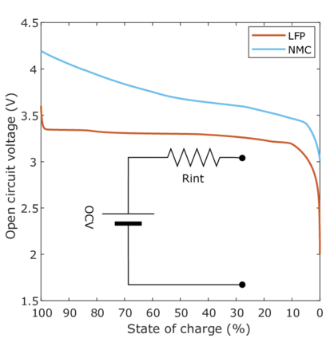
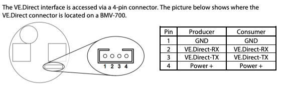
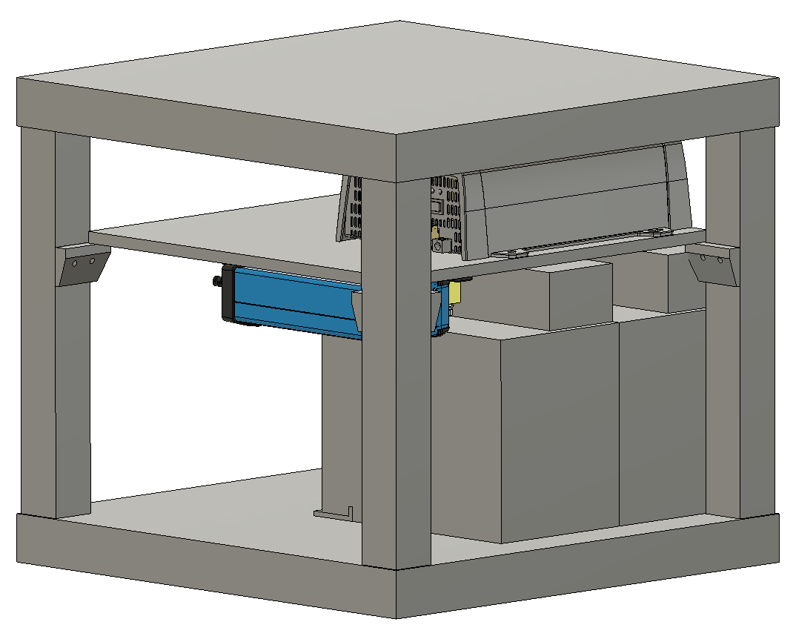

# DIY Lithium UPS
Documenting my quest to create a long-lasting and (relatively) cost-effective UPS using Lithium-ion batteries

## Disclaimer
Batteries with this much power can easily start fires or weld stray metal objects such as wrenches or metal jewelry that happen to short-circuit the terminals. Lithium battery fires are also no joke; they're self-oxidizing so once they catch fire you need a special type of fire extinguisher to put them out.  

All that to say, there is some inherent risk and don't hold me responsible if your house burns down.

# But why?
- Commercial lithium UPSes are _expensive_ ($2-3k on the low end). There's a few reasons for this, one being that you need relatively high output batteries to fit them in a compact package; often a 2U rack-mount form factor, which is only 3.5" tall. The second is only an assumption, but given that traditional lead-acid UPS batteries only last 2-3 years I'm sure major UPS manufacturers aren't in a hurry to kill their recurring-revenue replacement battery cash cow by offering Lithium-ion based units with batteries that last 8-10 years.
- Lead-acid batteries are really not ideal for a few different reasons.
    1. As already mentioned, lead-acid batteries have a limited lifespan, gradually reducing their usable runtime over the course of a few years to virtually nothing
    1. They also generally don't like being drained below 50%, while Lithium-ion batteries don't mind being drained all the way down to 10%
    1. Lead-acid batteries also have an unfortunately large [Peukert exponent](https://en.wikipedia.org/wiki/Peukert%27s_law). This means that the more power you draw at once, the less total power you can get out of the battery. If you spec out a UPS with say 30 minutes of runtime at 200 watts and over time increase the load to 400 watts, you won't end up with half the runtime, you'll be seeing a third instead. This before you even factor in the reduced capacity due to age
- Lead-acid batteries are cheaper than Lithium-ion, and as everyone knows dumping more money into your homelab means that you're objectively smarter, more attractive, and generally more fun to have at parties

# Parts List
- LFP (LiFePo4) battery/batteries with sufficient current output
- LFP battery charger
- AC/DC Inverter (Pure sine preferable)
- Battery monitor
- Battery fuses
- Battery cables
- Battery cutoff switch
- Automatic transfer switch
- Non-flammable mounting board
- Mounting hardware

### Voltage Selection
The higher your battery voltage the less output current it needs and the smaller your battery cables need to be. I went with a 12V system because I'm considering reusing the second battery elsewhere; otherwise I'd have gone with 24V so I could use lower gauge battery cables. If you're considering smaller batteries this can also be good because it halves the required output current required for the same output power.

### Batteries
I went with a pair of these [LiTime 12V 100Ah group 24 batteries](https://www.litime.com/products/12v-100ah-group-24-smart-bluetooth). One is sufficient for >2 hours of runtime at my usage of ~400 Watts. They've got a bluetooth-enabled BMS that you could theoretically use for more extensive tracking, but I ended up not using this feature much at all. They also have [this model](https://www.litime.com/products/12v-100ah-group-24-lithium-battery) that is slightly cheaper without the bluetooth feature.

### AC/DC Inverter
For this project I went with the Victron ecosystem for my setup. Victron hardware is very user-friendly, though that does come at a premium. Other hardware can be swapped in easily enough, though integrating with it may prove to be more difficult.

The specific inverter I used is the [Victron Inverter VE.Direct 12V/800VA](https://www.amazon.com/dp/B076T8MW4F). They have larger and smaller units, but keep in mind that 800VA is not the same as 800 Watts due to [power factor](https://en.wikipedia.org/wiki/Power_factor), so be sure to add some overhead when sizing your inverter. According to the datasheet, this 800VA unit is rated for 650W continuous.

### Battery Charger
Wanting to stay in the Victron ecosystem, I went with the [Victron BlueSmart Charger IP22](https://www.amazon.com/dp/B08NY23BKF) in 12V/30A trim. This won't be able to keep up with my power consumption, but it only needs to run when the batteries are no longer in use. It can be configured to synchronize with multiple chargers of the same type over bluetooth and act as one higher output charger if you need more juice however. Make sure you have a lithium-compatible charger and not a lead-acid battery charger. It will charge the battery, but the float charging done by lead-acid chargers will shorten the life of the batteries.

### Battery Monitor
For this purpose I once again stuck with the Victron ecosystem, using a [Victron BMV-712](https://www.amazon.com/dp/B075RTSTKS). Alternatively you can get a [Victron Smart Shunt](https://www.amazon.com/dp/d/B0856PHNLX) for less, but the main advantage of the BMV-712 for me is the configurable built-in alarm and LCD readout of the battery charge level/runtime. I currently have it set to go off at 90% so I get an early warning when the power is out. It also has a built-in relay that can be used to start a generator or trigger a warning light if that strikes your fancy.

Typically as a battery gets progressively discharged its voltage follows a gradual curve from peak voltage to near-empty. This means you can tell how much charge a battery has remaining by simply measuring its voltage with no load. LFP batteries however are notorious for having an exceptionally flat voltage curve; as a result, their state of charge can't be measured using voltage, and must be tracked by measuring current in or out using a battery monitor and a shunt.

**LFP vs. NMC voltage curves:**  


### Battery Fuses
As mentioned previously, these batteries have a lot of power in them so it's important to make sure they're protected by fuses to help prevent fires or other damage. You'll want to make sure the fuse you select is above your expected usage, plus a little bit of breathing room. For my 12V/800VA inverter with a 1500W peak output I went with [these 100A fuses](https://www.amazon.com/dp/B0CHJPL956). Under normal circumstances my inverter should only be pulling ~67A (800VA/12V), but 100A gives a bit of headroom over that for momentary spikes in output.

Some people only fuse the battery output where the battery positive goes to the charger/inverter, but since my rack is on wheels and things could get jostled around, I opted to put a fuse on each battery positive terminal individually.

### Battery Cables
Battery cables need to be sized appropriately for the amount of power they'll see. The inverter manual will likely tell you what size cable is required. For my inverter (12V/800VA) it recommends a minimum cable cross-section of 6awg/16mm<sup>2</sup> for cables up to 5ft/1.5m in length. Be sure to spec out your cable appropriately for the maximum capacity of your inverter; insufficient cable thickness will cause the wiring to heat up significantly during use, and having a fire in the middle of a power outage is objectively among the least convenient times.

I wanted ~3 ft of cable between the inverter and the batteries so these are the cable gauges/lengths I bought:
- (1x) 1 ft, 6 AWG, 3/8" (M10) ends, Black (battery to shunt)
- (1x) 2 ft, 6 AWG, 3/8" (M10) ends, Black (shunt to inverter)
- (1x) 3 ft, 6 AWG, 5/16" (M8) ends, Red (battery to shutoff)
- (1x) 1 ft, 6 AWG, 5/16" (M8) ends, Red (shutoff to inverter)
- (2x) 8 AWG, 50A Anderson SB-50 connector pigtails (charger negative to shunt, charger positive to battery shutoff) [link](https://www.amazon.com/dp/B0D62RT9CF)

### Battery Cutoff Switch
You likely will want to add a battery cutoff switch. This is handy to prevent sparking when disconnecting/reconnecting the battery terminals to the inverter or for emergency situations. There are any number of battery shutoff switches out there, just be sure they support the maximum output power of your inverter. I went with [this one](https://www.amazon.com/dp/B095X94JXF) from Victron since it's an important component and I wanted a name brand, but there are plenty of cheaper options available; some even have a voltmeter built in to display the battery voltage.

### Automatic Transfer Switch
If your charger(s) have enough output to power the load as well as charge the battery you can forego the transfer switch and make a double-conversion UPS of sorts, but there are a few downsides to this.
- No inverter or charger is 100% efficient; the ones I selected for example have peak efficiencies of 90% and 94% for a combined 85% end to end. So 400W of output from the inverter means 470W of draw from the wall, and that's absolute best case scenario
- The charger and inverter will have their cooling fans running continuously unless sufficiently oversized
- LFP batteries are charged at around 14.4V until they reach their peak, then allowed to rest at ~13.5V. In the case of a double-conversion setup this means the charger will continuously hold the batteries at the higher charging voltage, never letting them fall back down to their resting full voltage. This reduces the longevity of the batteries, as one of the contributing factors to battery degradation is electrolyte oxidation caused by higher battery voltages. This is the reason why it's recommended to keep most lithium ion batteries at a max charge of 80% or less. Because of LFP batteries' inherently lower cell voltages this is less problematic and they can be kept 100% charged with less degradation, but artificially keeping them above their max voltage will cause them to degrade at a faster rate.

For my setup, I went with this 120V 15A transfer switch: [link](https://www.amazon.com/dp/B0CR5VZLYD)  
It doesn't come with plugs however so you'll need two male and one female replacement plugs like some of these: [link1](https://www.amazon.com/dp/B0BMDT6NYW), [link2](https://www.amazon.com/dp/B007QVPQ96)

### Non-flammable Mounting Board
You'll want to mount your charger, inverter, shunt, and cutoff switch to a board for convenience sake and also to prevent movement that might lead to circuits being shorted out. My initial build is currently using 1/2" plywood that I had lying around, but I don't recommend it for fire safety reasons and I'll be soon replacing it with a piece of cement board.

### Mounting Hardware
For mounting devices to the board I used some stainless steel hardware (M4 bolt, washer, split/lock washer, and nut)

## Victron Monitoring
In order to pull all the Victron devices together into one manageable/monitorable unit you'll need a "GX" device. Victron offers [a variety of appliance-type devices](https://www.victronenergy.com/live/venus-os:start), but they also offer [Venus OS](https://github.com/victronenergy/venus/wiki), which can be flashed to a Raspberry Pi (2/3/4/CM4/Zero 2W)  
Setup of Venus OS is pretty straightforward for those experienced with Raspberry Pis so I won't go into detail here, but you can find instructions on the linked Venus OS wiki.

Once the devices are properly connected they'll pop up in the Venus OS interface automatically.

### VE.Direct Cables
Each of the listed devices can be connected to the "GX" device (Raspberry Pi) using a VE.Direct cable (USB UART to JST PH connector) with the exception of the BlueSmart Charger IP22. More on that [here](#bluesmart-charger-ip22).

Victron sells these [isolated VE.Direct cables](https://www.amazon.com/dp/B01LZ6WTLW). I'd recommend at least getting one for the battery monitor since it is powered by the battery directly via the shunt. Alternatively, an [Adafruit USB-to-TTL Serial Cable](https://www.adafruit.com/product/954) can be used along with a pre-made [JST PH 4-Pin Male Header Cable](https://www.adafruit.com/product/3955), for a good bit less money, though it does not provide electrical isolation.

Note: Ensure whatever USB-Serial adapter you use has TTL-level logic (3.3V, not the standard 5V). VE.Direct ports can all handle 5V on the power pins, but not all devices with a VE.Direct port are 5V-tolerant on the TX/RX pins.

#### Adafruit USB-TTL Serial pinout
Red: V+  
Green: TX  
White: RX  
Black: GND

#### VE.Direct Pinout
Note: Make sure to swap TX and RX between the adapter and the connector pinout  


### BlueSmart Charger IP22
The BlueSmart Charger IP22 has no external VE.Direct port, but dupont jumper wires can be connected to an internal 2.54mm header at the bottom right corner of the circuit board.

To open the case remove the 4 screws on the bottom (side with the cables/connectors) and the lid (with the logo, LEDs) will be able to slide down a bit, then can be pulled up. Be careful with the cables running to the LEDs on the lid however.

More info and annotated pictures can be found in the repo below.  
*Note: none of the software configuration in the linked repo is required.*  
https://github.com/pvtex/Victron_BlueSmart_IP22

The internal 2.54mm header is arranged in a 2x3 layout with one pin missing and the following pinout:
```
[1] [2] [3]
    [4] [5]
```
1. GND
2. Unused
3. 3.3V - Unused except with an isolated cable
4. TX - Make sure to swap TX and RX on the adapter as is typical for UART
5. RX

## Lack Rack Shelf Brackets
I have this setup in a Lack Rack at home so I designed these brackets that take M3 x 5mm x 4mm (Voron spec) threaded inserts along with a drill guide for pre-drilling holes in the Lack table legs at a consistent height.

The inner dimension between the legs is 444mm (~17.5") and the outer dimension of the legs is 544mm (~21 3/8"). I recommend cutting your board just shy of those two dimensions so it can slide in from one side and rest stably in the other dimension.



# Assembly
0. Before beginning, you may want to remove any metallic jewelry (rings, bracelets, necklaces). Unexpected electrical conductors attached to your body can cause unpleasant surprises
1. Mount the components in the locations where you'd like them to be
1. If you bought pre-made cables with battery terminals on both ends for the inverter cut off the terminal on one end, strip off a bit of the insulation, insert it into the inverter's terminals, and tighten them down
1. Connect the other end of the negative cable to the charger/load side of the shunt
1. If you have a battery shutoff switch, turn it to the off position now and run the positive cable from the inverter to the shutoff switch, then attach the shutoff -> battery positive cable to the switch, leaving the battery side disconnected
1. Ensure the inverter is switched off
1. Connect the battery negative cable from the battery terminal to the battery side of the shunt. At this point the circuit is nearly live; if the negative cable touches the positive terminal things will get welded and fuses will get blown, so be careful
1. Attach the fuse(s) to the positive side battery terminal(s)
1. Double-check that the inverter is off, nothing is plugged into its output, and the shutoff switch is in the off position
1. Run the battery positive cable from the shutoff switch (or from inverter if no shutoff) to the fuse post. There may be some brief sparking if you don't have a shutoff switch, even with the inverter off
1. Insert the end of the battery monitor positive cable with a ferrule into the B1 port on the shunt and attach the other end to the battery fuse post
1. Disconnect the SB-50 connectors if they're connected and attach the positive lead from one of the connectors to the positive battery fuse post
1. Attach the negative lead from the same connector to the Load/Charger side of the shunt. Make sure it's connected to the Load/Charger side and not the Battery side, otherwise the battery monitor won't be able to track how much power the charger has put into the battery. I used a washer and attached it to the screw terminal on the side.
1. Ensure the charger is unplugged before continuing
1. Cut off the attached terminals from the other SB-50 connector pigtail, strip back a bit of insulation, insert the wires into the corresponding terminals on the charger and tighten them down
1. Connect the two SB-50 connectors together and plug in the charger

All that's left is to connect the VE.Direct cables to the "GX" device/Raspi running Venus OS, connect the RJ-12 cable to the shunt and the battery monitor and go through its initial configuration steps. You should see the charger, inverter, and battery monitor all show up in the Venus OS interface (http://venus.local). If anything is not showing up and you're using DIY cables, doublecheck your pinouts and ensure you have TX->RX and RX->TX as is customary for UART/Serial connections.

# Home Assistant Integration
For Home Assistant I'm currently using the [Victron GX modbusTCP integration](https://github.com/sfstar/hass-victron), installable through HACS. I'm still in the process of configuring it so I don't have any configurations to share at the moment.